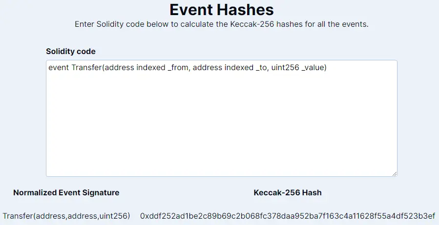
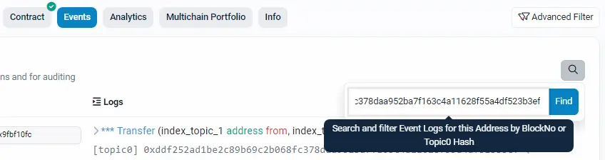
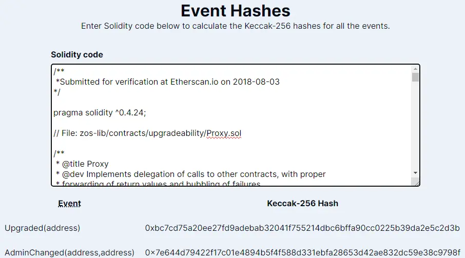

# event-hashes

This is a minimal web utility to calculate the `keccak256` hashes of the normalized event signatures of all the events in a Solidity code block. This hash can then be used with indexers like Etherscan to search for specific logs in the EVM history.

> [!WARNING]<br>
> This tool won't work with [user-defined value types](https://docs.soliditylang.org/en/latest/types.html#user-defined-value-types). For events that include these types, you must manually convert the user-defined value type into its equivalent primitive type.

## Example



Given the [standard ERC-20 `Transfer` event](https://eips.ethereum.org/EIPS/eip-20#events):

```
event Transfer(address indexed _from, address indexed _to, uint256 _value)
```

The tool will normalize the event signature (i.e., remove spaces, input names, and extraneous keywords):

```
Transfer(address,address,uint256)
```

Then calculate the `keccak256` hash of the UTF-8 encoded bytes of the normalized signature:

```
0xddf252ad1be2c89b69c2b068fc378daa952ba7f163c4a11628f55a4df523b3ef
```

This hash may then be used in another tool to filter a smart contract's logs, e.g. [in Etherscan](https://etherscan.io/address/0xa0b86991c6218b36c1d19d4a2e9eb0ce3606eb48#events):



## Features

**Intelligently parse entire smart contracts**

There's no need to manually extract the event signatures from the smart contract code. The tool will automatically ignore lines that don't contain event signatures.


