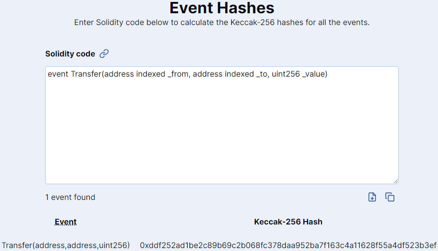
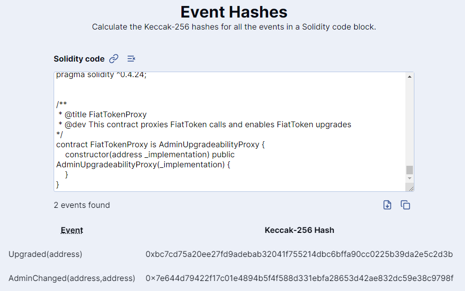

# event-hashes

This is a minimal web utility to calculate the `keccak256` hashes of the normalized event signatures of all the events in a Solidity code block. This hash can then be used with indexers like Etherscan to search for specific logs in the EVM history.

> [!WARNING]<br>
> **Known issues:**
> - This tool won't work with [user-defined value types](https://docs.soliditylang.org/en/latest/types.html#user-defined-value-types). For events that include these types, you must manually convert the user-defined value type into its equivalent primitive type.
> - This tool won't work with multi-line event definitions. For events that span multiple lines, you must manually collapse the definition into one line.

## Example



Given the [standard ERC-20 `Transfer` event](https://ercs.ethereum.org/ERCS/erc-20#events):

```
event Transfer(address indexed _from, address indexed _to, uint256 _value)
```

The tool will normalize the event signature (i.e., remove spaces, input names, and extraneous keywords):

```
Transfer(address,address,uint256)
```

Then calculate the `keccak256` hash of the UTF-8 encoded bytes of the normalized signature:

```
0xddf252ad1be2c89b69c2b068fc378daa952ba7f163c4a11628f55a4df523b3ef
```

This hash may then be used in another tool to filter a smart contract's logs, e.g. [in Etherscan](https://etherscan.io/address/0xa0b86991c6218b36c1d19d4a2e9eb0ce3606eb48#events):


## Features

**Intelligently parse entire smart contracts**

There's no need to manually extract the event signatures from the smart contract code. The tool will automatically ignore lines that don't contain event signatures.



**Copy permalinks to code blocks**

You can easily share links to events with other people. The entire codeblock is compressed and encoded into the URL hash of the permalink and is decoded client-side (i.e., nothing is shared with a server).

For example, [here's a permalink](https://event-hashes.ardis.lu#H4sIAAAAAAAACu1Y33MbtxF+11+xo5eSmTPFOLGbsSed0Owp5oxMuSTbjl+aAw97JKI74ArgRNGZ/u+dBQ73i5RsN2knD9WLpLvDYvf7vl3sotRsVzAwKhdc2CP8Yzr5dvJ8+vri4urqCn6wwuYI8Wr+7I/Pv4alks+uK7kT2xxho+5QwtoyyZnm/nOO97BGhL21pXl1dYWiNBO0e9RYFROld1fx4v2aHpM9twaWyuIrsHu/zdcvX4DgKK3IBGrIlAa7FwaEtKgzliIIA9OH76YsffFdyicX7Yt4NScnr76iT+LVnEx9dQW/XAAANO5tyBoWwho47FGCOkjUZi9KUBkweYTl9QbSPZM7NLA9ukcF0gNhikljq7Zzj9J2rS2vNwaYRkg1MoscRkmmVZHA99/DdAxMcuBorFZH5K2tUWJV/ckE4ocUSyuUfAW80kLuIFXSapZab1QoGTmvZFVsUZPbtGtrrWBH2LYe0J7MGLGTyOEg7F5V3mVLtjeaSZOhnsDMOhKsKBBU1pqjrWz9VeQ+YWWp1T2Z5lyjMTVLzDrsRsLhOCYWNBq0YBVIJdGD5yEL246CCSE5PiCHnwiuCE4eWxVBJaR9/uJl9+EdygUfv754muNHnWaOMfLUM85B6TZyjSzLhC6QT2CzR/iIWnU9EymzaMDJm2xIdbJLRzB/J09YE3lXO5HXOMuN6tlltud6h5P/GPiZs8XyU+BdIpxBPuz+K/BnElSJmlmlyTmUbJs7rIEL4/+u2XBO9LIM26Upk1AwyXYILM99rqnMQdRZ14/zWulZ/gXRhs0i2CqVt9H3YpTKihRhrippW1eaJLOqCaWPy8lndqgqVzqUNIKjRg5C3rNc8MglMWmkRSarZEq1AOxeq4OXwj8r1AINsC3l+NB4C+sPJdOsqEGAmezp6bBXBflGxo7OyJblTKbYLtdoKy0dOf0i5ILmVDYTbzyJoFTGiG1+dL44G43rteHbrOHHrxoDPljUkuVwL/AAfj8Do1qB58i4Fg6iWgq+mJNPn2Dgs9Gvse3kYAC5AK48C6cI1xnioBoca0P3OqAGf7riDv+ENQ2I7u1tFrBps/IxEGvr50AMxcm0+7ZHoysyVJ5BydZHJ3ZFNTA8GtYCJ89K5vR1UpjdxKDkqBMqBbRNWmlNKRtSUgKr7F5p8bFb8trEdDXv0VNIGPJzEvYVGSQ/+SO4mz1S2dO9+4voSK497GVR+1FrLgmgJ/4csMDAacf74kp/OEPdaaOKMkeLdeEPXLYG0z2md31HGJiCadt2A6NUcQQjPiL8yXUOiwyMikBYSFmed6JNlPTN0QpTFPfIE1CytuwrSwiboq2FeM/yqj7WbMfU9mjRfDu6wzRld89fvBxdDo0HgUXhd63MyC0dX47HyWmiOF1thowMRd9PLV+A8DAstWdyj6RL9bbmYPgtZ5bBjHNBLLDc/0+9Ep3ppsSU0tYdUgWzERhyUEgHM5l1SPaz0rAMQzZda1W0Fa7f4PQam+ByBA4q50YnjUt2pMPyf5W3wsBBaVKhK1wU7DEcWn5hE62DiklyVTOPngMWLeqoFQ+61ravefi5MhYMWh8ubXB5+bvQx2/D5Rfxd5a6Z89g8zaG+ezmJl7BYg2reP3+drlevLmJO53SLcxvl9eL1TvYvJ1t6uxerGE+ez97cxPD7TWs4nm8+Nti+SPZXcPtCuKbddfG2/gDvJt9gDcxvI9X72bLeLm5+QA3t+vN/6v6oKr/riRq/6vynLvhiCgKI9GnRqqhWn7t8PT5eiOYas15b56SXSCnL5gTGhrHAlvNA3dZQAeyyvPP469e2qevftgydzp0fRFhsZuwOgNWvQPLPUeUUZpTjbZHGF0GOC7H5KEfsTqNbp4TTl3Q/+CaaLSDMyN2Ix8B2h+//Ezmh+imfXn31/WGbKtD5+qiyq0o83bmM1CGqnhmfAkszjpnGm8GK5qAqYo2/LdWn2BYU9NT992dmbUlJGO5QdpD4726a5EdnBloHxlBHx8xG2bPMPoj2idyDoyQuxzPZV639H1BMTuj3CxMWOd8OD/HPFXMm5LfrwxZtyTIQZ7sAqrIf5N55y9uxnX3Jq0Hpl81Whn48vZIz9QbqbtDnLufUQdpwjFwZlHY4WQdS62hXn2Le5ZnvYHwFPFaukljLwnBBB56obQjupe0C+wgzABzYQLkJ0Lu36E02z7KBOl9/PriXxf9W1u6qP3lCW7amiFobCpQWhdWY2QIaPNi8Wc/ebeXx80MHgEzndZeyHD93E+gxcnSlNWwnF098Y3z6URXGTSQ18RK+GYaTadT2LHutUxNZGJ1hUmoQueCTzoRuhGu07T0XtWpPn3I6p8IEsd28hjdpipLpa1pAh/5ia8L6icJ/jctifcpVhgAAA==) to the [ERC-721](https://ercs.ethereum.org/ERCS/erc-721) interface:


